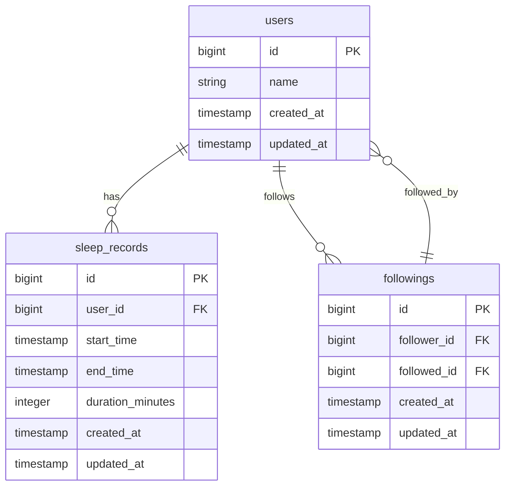

# Good Night Application

A Rails 8 API for tracking sleep patterns and following other users.

## Project Overview

This application provides a REST API for users to track their sleep schedules and connect with others. Built with Ruby 3.3.4 and Rails 8, it demonstrates modern API development practices with a focus on performance, scalability, and code quality.

## Features

- **Sleep Tracking**
  - Clock in when going to bed
  - Clock out when waking up
  - View personal sleep records sorted by creation time

- **Social Connection**
  - Follow other users
  - Unfollow users
  - View list of followed users

- **Social Sleep Analysis**
  - View sleep records of followed users
  - Filter to the previous week
  - Sort by sleep duration
  - Chronological presentation of all records

## Architecture Highlights

- **Middleware-Centric Error Handling**: Centralized error handling through middleware that intercepts exceptions and formats consistent API responses
- **Service-Oriented Design**: Domain logic encapsulated in service objects with a consistent interface
- **Validator Pattern**: Input validation through dedicated validator classes that raise appropriate exceptions
- **API-First Design**: RESTful endpoints with comprehensive filtering, sorting, and pagination
- **Redis Caching**: Optimized performance with Redis-based caching for frequently accessed data

## Technical Requirements

- Ruby 3.3.4
- Rails 8
- PostgreSQL 16
- Redis 7 (for caching)
- Docker & Docker Compose (for containerized development)

## Getting Started

### Prerequisites

Ensure you have the following installed:

- Docker and Docker Compose
- Git

### Setup

1. Clone the repository:

   ```bash
   git clone git@github.com:prasaria/good_night_app.git
   cd good_night_app
   ```

2. Start the Docker environment:

   ```bash
   docker-compose up
   ```

3. Access the API at `http://localhost:3000`

### Database Setup

The database will be automatically set up when you start the Docker environment. If you need to run migrations manually:

```bash
docker-compose exec web rails db:migrate
```

To reset the database:

```bash
docker-compose exec web rails db:reset
```

To seed the database with development data:

```bash
docker-compose exec web rails db:seed
```

## Development

### Running the Rails Console

```bash
docker-compose exec web rails console
```

### Running Tests

```bash
docker-compose exec web bundle exec rspec
```

View test coverage reports in the `coverage` directory after running tests.

### Database Operations

```bash
# Run migrations
docker-compose exec web rails db:migrate

# Rollback last migration
docker-compose exec web rails db:rollback

# Rollback multiple migrations
docker-compose exec web rails db:rollback STEP=3

# Seed the database
docker-compose exec web rails db:seed
```

### System Health Checks

The application includes health check endpoints to verify system components:

```bash
# Check Redis cache health
curl http://localhost:3000/health/redis
```

### Code Quality

This project uses several code quality tools:

```bash
# Run RuboCop
docker-compose exec web bundle exec rubocop

# Run Brakeman security scan
docker-compose exec web bundle exec brakeman

# Run all code quality checks
docker-compose exec web bundle exec rake code_quality:all

# Auto-fix issues where possible
docker-compose exec web bundle exec rubocop -A
```

## Database Structure

### Database Schema (ERD)



### Models and Relationships

- **User**
  - Has many sleep records
  - Has many followings (as follower)
  - Has many followed users (through followings)
  - Has many reverse followings (as followed)
  - Has many followers (through reverse followings)

- **SleepRecord**
  - Belongs to a user
  - Records start time, end time, and duration
  - Ensures no overlapping sleep records for the same user
  - Provides scopes for completed, in-progress, and recent records

- **Following**
  - Associates a follower user with a followed user
  - Ensures unique follower/followed combinations
  - Prevents users from following themselves

### Database Indexes

The application uses strategic database indexes to optimize common queries:

- **Sleep Records**:
  - Index on `user_id` for quick access to a user's sleep records
  - Composite index on `(user_id, created_at)` for ordered retrieval
  - Composite index on `(user_id, start_time)` for date range queries
  - Composite index on `(start_time, end_time)` for duration-based queries

- **Followings**:
  - Index on `follower_id` for finding who a user follows
  - Index on `followed_id` for finding a user's followers
  - Unique composite index on `(follower_id, followed_id)` to prevent duplicate relationships

## Testing Approach

This project follows Test-Driven Development (TDD) principles:

- **Model Tests**: Comprehensive validation and business logic tests
- **Factory Setup**: FactoryBot factories with traits for various test scenarios
- **Shoulda Matchers**: For testing validations and associations
- **Coverage Tracking**: SimpleCov ensures 90%+ test coverage
- **Database Cleaner**: Ensures clean test state between examples

### Test Categories

- **Unit Tests**: Testing individual components in isolation
- **Integration Tests**: Testing interactions between components
- **End-to-End Tests**: Testing complete user workflows
- **Edge Case Tests**: Testing boundary conditions and error scenarios
- **Security Tests**: Testing access controls and validation

### Example Test Execution

```bash
# Run all tests
docker-compose exec web bundle exec rspec

# Run specific test file
docker-compose exec web bundle exec rspec spec/models/user_spec.rb

# Run end-to-end tests
docker-compose exec web bundle exec rspec spec/e2e
```

## API Endpoints

### Sleep Records

- `POST /api/v1/sleep_records/start` - Mark sleep start time
- `PATCH /api/v1/sleep_records/:id/end` - Mark sleep end time
- `GET /api/v1/sleep_records` - Get current user's sleep records with filtering, sorting, and pagination options

### Following System

- `POST /api/v1/followings` - Follow a user
- `DELETE /api/v1/followings/:id` - Unfollow a user
- `DELETE /api/v1/followings` - Unfollow a user (using follower_id and followed_id)
- `GET /api/v1/followings` - Get list of users the current user follows with sorting and pagination

### Following Sleep Records

- `GET /api/v1/followings/sleep_records` - Get sleep records of followed users with filtering, sorting, and pagination

### System Health

- `GET /health/redis` - Check Redis cache connectivity and performance

## Key Components

### Error Handler Middleware

The application uses a centralized error handling middleware that:

- Captures exceptions throughout the application
- Maps exceptions to appropriate HTTP status codes
- Provides consistent JSON error responses
- Includes additional debugging information in development

### Validators

Input validation is handled by dedicated validator classes that:

- Perform parameter presence and format validation
- Raise appropriate exceptions for validation failures
- Provide clean access to parsed and validated data

### Service Objects

Business logic is encapsulated in service objects that:

- Follow a consistent interface pattern
- Handle one specific action or workflow
- Raise domain-specific exceptions for error conditions
- Return data directly rather than wrapping in result objects

### Serializers

API responses are formatted by serializers that:

- Provide consistent JSON structure
- Include appropriate relationships
- Avoid N+1 query issues through proper eager loading
- Support conditional inclusion of related data

### Caching Layer

Data retrieval is optimized through:

- Redis-based caching for frequently accessed data
- Intelligent cache key generation incorporating user context, parameters, and timestamps
- Automatic cache invalidation upon data changes
- Graceful fallback to database when cache is unavailable

## Scalability Strategies

This application is designed to handle high data volumes and concurrent requests through:

- Optimized database indexing
- Connection pooling
- Redis caching with namespace isolation
- API pagination
- Fiber-based concurrency for I/O operations (TBA).
- Efficient query optimization

## CI/CD Pipeline

The GitHub Actions CI pipeline runs:

1. Security scanning (Brakeman)
2. Code linting (RuboCop)
3. Test suite with coverage verification
4. Docker image builds

## Project Structure

This project follows a modular, service-oriented architecture inspired by Spree Commerce:

- Controllers handle HTTP request/response cycle
- Service objects encapsulate business logic
- Serializers format API responses
- Validators ensure data integrity
- Middleware provides cross-cutting concerns
- Cache helpers optimize data retrieval performance

## Troubleshooting

### Common Issues

- **Redis Connectivity**: If caching isn't working, check Redis connection via the `/health/redis` endpoint
- **Database Connectivity**: Ensure PostgreSQL container is running and healthy
- **Cache Invalidation**: If stale data appears, try clearing the cache via Rails console: `Rails.cache.clear`

## License

This project is using MIT Licensed and created as part of an interview exercise.

## Acknowledgments

- Built with Ruby on Rails 8
- PostgreSQL for reliable data storage
- Redis for high-performance caching
- Docker for consistent development environments
